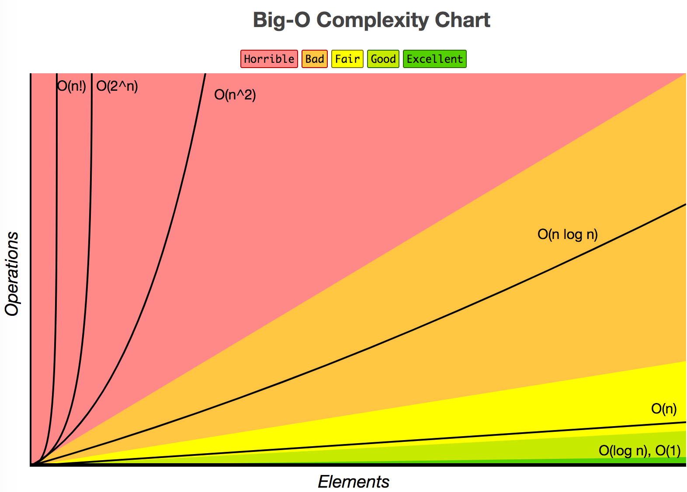

# sorting-algorithms

Sorting Algorithms

## 如何评价算法好坏

算法，即计算方法。为了实现某些目的，比如排序，我们需要制定一个详细的过程，这个详细过程就可以称为算法。
现实中，实现同样的目的可能有不同的方法，有些方法耗时更少，有些则耗资源更少。那么，到底哪种方法才是最好的呢？

在计算机科学中，有个评价方式叫做大 O 表示法（Big-O）。大 O 表示法起源于数学界，可以把它看成是一个包含变量 N 的数学函数，N 表示数量，该函数输出值越大表示复杂度越高。如下图所示，可以看出，复杂度随着 N 的变化趋势。其中，不同的颜色对应不同的复杂度评价，红色表示很糟糕、难以接受，绿色则表示非常棒、简单高效。



> 图片来自 [bigocheatsheet.com](http://bigocheatsheet.com/)

基于大 O 表示法，通常使用两种方式来评价一个算法：

* 时间复杂度：算法运行完总共需要的**操作**次数
* 空间复杂度：算法运行完总共需要消耗的**内存**

常见的复杂度级别：

* 常数级 `◯(1)`
* 对数级 `◯(log N)`
* 线性级 `◯(N)`
* 线性对数级 `◯(N log N)`
* 平方级 `◯(N ^ 2)`
* 指数级 `◯(2 ^ N)`
* 阶乘级 `◯(N!)`

除了时间复杂度和空间复杂度，还有一些辅助的特征用来评价一个排序算法：

* 稳定性：如果 `a = b` 且 `a` 在 `b` 之前，排序后 `a` 仍排在 `b` 之前则算法是稳定的
* 内排序：排序操作均在内存中完成；外排序：待排序数据量太大，需借助外部存储才能完成；

另外，一个排序算法的时间复杂度并不是固定的，因为待排序数据本身的排序方式是不固定的。比如待排序数据是倒序的，或者刚好已经是正序的。因此，还需要区分不同情况下的时间复杂度：

* 最佳情况：待排序列已经是正序
* 最差情况：待排序列是倒序
* 平均情况：待排序列是随机序列

但是，大多数情况下，我们说一个算法的时间复杂度，是指平均情况。

文中涉及的排序算法实现见[项目源码](./src)。

## 常见的排序算法

* Bubble Sort
* Insertion Sort
* Selection Sort
* Merge Sort
* Heap Sort
* Quick Sort
* Shell Sort
* Timsort
* Bucket Sort
* Radix Sort

## 冒泡排序

### 算法描述

冒泡排序是很形象的算法，估计其发明者的灵感就来自于水中气泡的上升过程。气泡在水中上升时，会越来越大。如果把排序过程想象成气泡上升过程，那么通过比较相邻的两个值，就可以逐渐地把最大值“浮”到序列最后。一次这样的冒泡过程可以“浮”出一个最大值，所以“浮”动 `N - 1` 次就可以把 N 个值排好序。

### 算法步骤

1. 比较相邻的元素，如果前者大于后者，则交换位置
2. 从位置 0 到 N - 1 ，对每一对相邻元素进行步骤 1 操作，此时最大值已经交换到 N - 1
3. 令 N = N - 1，重复 1、2 步骤，直到 N = 0

### 复杂度

| 最佳情况 | 最差情况 | 平均情况 |
| :---: | :---: | :---: |
| O(N) | O(N ^ 2) | O(N ^ 2) |

空间复杂度：O(1)

可以看出，其时间复杂度是平方级，已经达到不能让人接受的程度。因此，实际应用中很少用这种排序算法。

## 插入排序

### 算法描述

插入排序把序列本身分成两部分来看待：已排序部分和未排序部分。最开始时，已排序部分长度为 0 ，未排序部分长度为 N；到最后，已排序部分长度为 N，未排序部分长度为 0 。它直接操作序列本身，不需要额外的内存空间。

### 算法步骤

1. 假设序列前面部分已排序，后面部分未排序
2. 取出未排序部分的第一个元素，记为 tmp
3. 从右往左，逐一比较已排序序列的元素，直到发生 tmp 的赋值：如果该元素大于 tmp，则该元素右移一位；否则将 tmp 赋值给它的后一位
5. 重复2、3，直到未排序长度为 0

### 复杂度

| 最佳情况 | 最差情况 | 平均情况 |
| :---: | :---: | :---: |
| O(N) | O(N ^ 2) | O(N ^ 2) |

空间复杂度：O(1)

## 选择排序

### 算法描述

选择排序与插入排序一样，把序列本身看成已排序部分和未排序部分。不同的是，它的已排序部分只会在尾部增加，而不会在中间插入。

### 算法步骤

1. 初始化已排序和未排序部分的分隔位置为 n = 0
2. 遍历分隔位置右侧未排序部分，找出其最小值的位置
3. 交换分隔位置的值和最小值
4. 分隔位置向右移动一位，即 `n++`
5. 重复 2、3、4 步骤，直到 `n = length - 1`

### 复杂度

| 最佳情况 | 最差情况 | 平均情况 |
| :---: | :---: | :---: |
| O(N ^ 2) | O(N ^ 2) | O(N ^ 2) |

空间复杂度：O(1)

不管在什么情况下，选择排序的时间复杂度始终一致。

## 归并排序

### 算法描述

归并排序的核心是**分治思想**。它把待排序序列从中间截断，分割成两个序列，然后有分别对两个新序列进行分割，直到分隔后的序列只有一个元素，一个元素的序列其实就是已排序序列；
之后就从单元素序列开始逐渐往回合并，即将两个已排序序列合并成一个已排序序列，直到只剩一个序列，即为排序结果。

### 算法步骤

1. 把长度为 N 的序列分割成长度为 `N/2` 的两个子序列
2. 对两个子序列分别应用归并排序
3. 合并子序列

### 复杂度

| 最佳情况 | 最差情况 | 平均情况 |
| :---: | :---: | :---: |
| O(N) | O(N log N) | O(N log N) |

空间复杂度：O(N)

## 快速排序

### 算法描述

快速高效的排序算法，它同样使用的是分治思想。归并排序的“分”是从中间截断，一分为二；快速排序则是选择一个比较基准（pivot），比该基准小的元素分在一个序列，大的分在另一个序列。

### 算法步骤

1. 从序列中挑出一个元素作为基准，通常是第一个元素或者中间位置的元素
2. 遍历序列（不含基准），把比基准小的元素放入 left 序列，大的放入 right 序列
3. 对 left 和 right 进行 1、2步骤
4. 合并 left 、基准、 right 序列即得已排序序列

### 复杂度

| 最佳情况 | 最差情况 | 平均情况 |
| :---: | :---: | :---: |
| O(N log N) | O(N ^ 2) | O(N log N) |

空间复杂度：O(N)

## 堆排序

### 算法描述

### 算法步骤

### 复杂度

## 计数排序

### 算法描述

### 算法步骤

### 复杂度

## 桶排序

### 算法描述

### 算法步骤

### 复杂度

## 基数排序

### 算法描述

### 算法步骤

### 复杂度

## 另类排序

### 睡眠排序（Sleep Sort)

```javascript
const numbers = [3, 5, 2, 1, 8];
numbers.forEach(n => {
  setTimeout(() => {
    console.log(n)
  }, n);
});
```

时间复杂度号称：O(WTF)

### 随机排序

随机排序应该是史上最愚蠢的排序。

该算法把待排序列随机排序，如果没有排好序，那么再次随机排序，直到排好序位置。

时间复杂度：O(N!)，大有 O(∞) 的趋势。

### 指鹿为马排序

找一群人，并向他们展示带排序数组。逐个询问他们数组是否已经顺序。干掉其中认为没有排序好的人。

时间复杂度：O(N)


## 参考

* [damonare/Sorts](https://github.com/damonare/sorts)
* [奇怪的排序算法](http://mp.weixin.qq.com/s?src=11&timestamp=1504449089&ver=370&signature=w6BQft*ipt1ZpOdJ6k*dzfRcVprqt6x5NqgIaxN7Qgm1bUhy4Z0PRRAi0MelY9rZAof2XAOW64eErAaen1sMbqtZSyUZ1IYHAlvXRwUhNxZLfYF2FcTM6ETuGeYWrvXI&new=1)